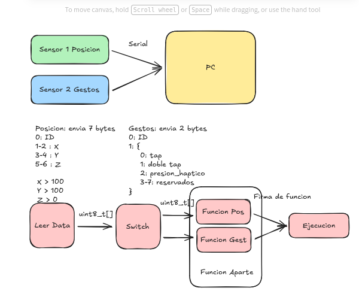

# EP5801 - Programación Avanzada en C

## Tarea 3

### Descripción
Este proyecto consiste en la implementación de **bitfields** y **estructuras** en C, simulando la entrada simple de un microcontrolador y siguiendo la estructura del diagrama proporcionado. El objetivo es procesar datos provenientes de dos sensores (posición y gestos) y ejecutar las funciones correspondientes según los datos recibidos.

---

### Estructura del Proyecto
El proyecto está estructurado de la siguiente manera:
- **src/**: Contiene los archivos fuente del proyecto:
  - `main.c`: Archivo principal en C que implementa la simulación de los sensores y el procesamiento de datos.
  - `sensors.h` y `sensors.c`: Archivos que definen y manejan las estructuras y bitfields para los sensores de posición y gestos.
  - `execution.c`: Archivo que contiene las funciones de ejecución basadas en los datos procesados.
- **makefile**: Archivo que define las reglas para compilar y ejecutar los programas.

---

### Diagrama de la Estructura
El proyecto sigue la estructura del siguiente diagrama:

---

### Detalles de Implementación
1. **Sensores**:
   - **Sensor 1 (Posición)**: Envía 7 bytes de datos que incluyen:
     - Byte 0: ID del sensor.
     - Bytes 1-2: Coordenada X.
     - Bytes 3-4: Coordenada Y.
     - Bytes 5-6: Coordenada Z.
   - **Sensor 2 (Gestos)**: Envía 2 bytes de datos que incluyen:
     - Byte 0: ID del sensor.
     - Byte 1: Tipo de gesto (0: tap, 1: doble tap, 2: presión háptica, 3-7: reservados).

2. **Procesamiento**:
   - Los datos se leen y se almacenan en estructuras con **bitfields** para optimizar el uso de memoria.
   - Se utiliza un **switch** para determinar el tipo de sensor y redirigir los datos a las funciones correspondientes:
     - `Funcion Pos`: Procesa los datos del sensor de posición.
     - `Funcion Gest`: Procesa los datos del sensor de gestos.
   - Las funciones de ejecución realizan las acciones correspondientes según los datos procesados.
